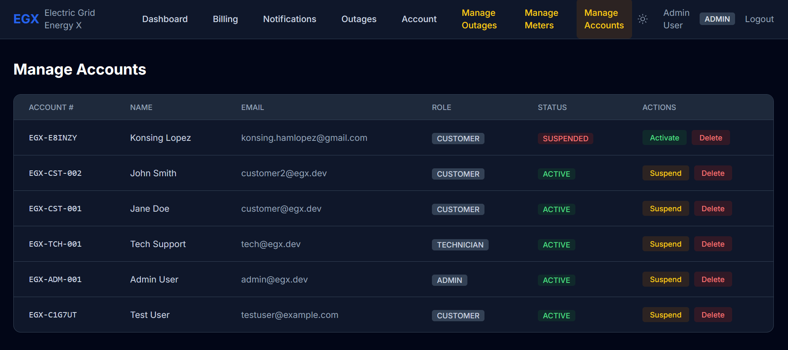
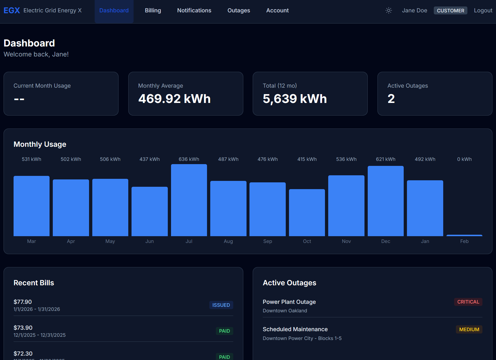
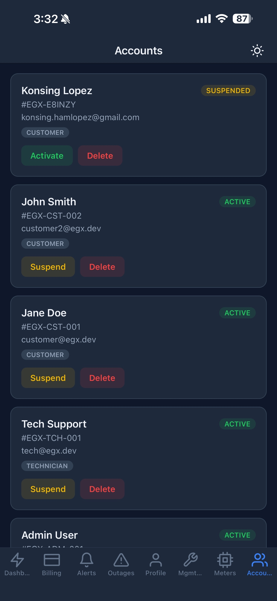
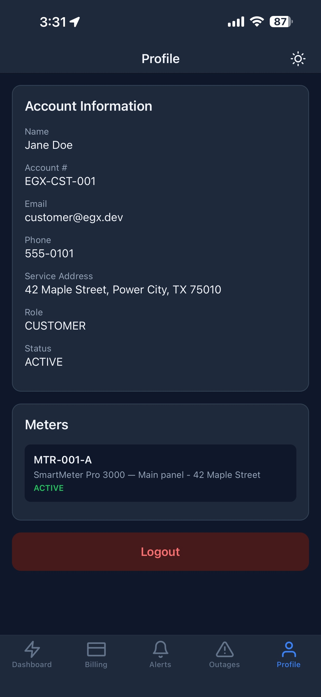

# Electric Grid Energy X

Full-stack portfolio project for a fictional regional electricity provider. Demonstrates senior-level engineering across a TypeScript monorepo: production-pattern RESTful API, responsive web portal, cross-platform mobile app, and shared code infrastructure.

## Web App


*Admin — Manage Accounts Panel*


*Customer — Dashboard*

## Mobile App

<p align="center">
  
  
</p>

## Live Demo

| Platform | URL | Hosting |
|----------|-----|---------|
| **Web App** | [egx-web.vercel.app](https://electric-grid-energy-x-web.vercel.app/) | Vercel (Free) |
| **API** | [egx-api.onrender.com](https://egx-api.onrender.com) | Render (Free) |
| **Database** | Managed PostgreSQL | Neon (Free) |
| **Mobile App** | Available on Expo Go | Expo (Free) |

> **Note:** The Render free tier spins down after inactivity. The first request may take ~30 seconds to cold-start.

## Architecture

```
electric-grid-energy-x/
├── apps/
│   ├── api/          Express + TypeScript + Prisma (38 endpoints, 9 models)
│   ├── web/          Next.js 14 App Router + Tailwind
│   └── mobile/       Expo + React Native (Expo Router)
├── packages/
│   ├── shared/       Types, validators, error codes, utils
│   ├── ui/           Tailwind component library
│   └── tsconfig/     Shared TypeScript configs
└── scripts/
    └── benchmark.ts  Reproducible performance proof
```

### Deployment Architecture

```
┌─────────────┐     ┌──────────────┐     ┌──────────────┐
│   Vercel     │────▶│    Render     │────▶│     Neon      │
│  (Next.js)   │     │  (Express)   │     │ (PostgreSQL)  │
│   Web App    │     │     API      │     │   Database    │
└─────────────┘     └──────────────┘     └──────────────┘
                           ▲
┌─────────────┐            │
│   Expo Go    │────────────┘
│ (React Native)
│  Mobile App  │
└─────────────┘
```

## Key Engineering Decisions

| Concern | Implementation |
|---------|---------------|
| **Auth** | JWT with `AuthProvider` factory — Firebase in prod, LocalJwt in dev (`MOCK_AUTH=true`) |
| **RBAC** | Three-layer middleware: `authenticate → authorize(roles) → requireAccount(ownership)` |
| **Idempotency** | `idempotencyKey @unique` on MeterReading, Payment, Notification — replay returns same result (200), not rejection (409) |
| **Optimistic Locking** | `BillingCycle.version` — `UPDATE WHERE id=x AND version=n` prevents concurrent status races |
| **Soft Deletes** | `User.deletedAt` — GDPR right-to-erasure pattern, never hard-delete |
| **Audit Trail** | `AuditLog` append-only with `traceId`, `metadata Json` — every state change logged |
| **Pagination** | Cursor-based (`WHERE id > cursor ORDER BY id LIMIT 20`) — stable for concurrent writes |
| **Performance** | Strategic PostgreSQL indexing with reproducible benchmark proof (`pnpm benchmark`) |
| **Error Handling** | Single `errorHandler` middleware → `ApiResponse` envelope (`{ success, data } | { success, error }`) |

## Quick Start

```bash
# Prerequisites: Node 18+, PostgreSQL, pnpm

# 1. Install dependencies
pnpm install

# 2. Set up environment
cp apps/api/.env.example apps/api/.env
cp apps/web/.env.example apps/web/.env
cp apps/mobile/.env.example apps/mobile/.env
# Edit DATABASE_URL if needed — defaults work with local PostgreSQL

# 3. Database setup
pnpm --filter api exec prisma migrate dev --name init
pnpm --filter api exec prisma db seed

# 4. Start API
pnpm --filter api dev
# ⚡ Electric Grid Energy X API running on port 3001

# 5. Verify
curl http://localhost:3001/api/health
# → { "success": true, "data": { "status": "ok", "uptime": ... } }

# 6. Dev login (no password needed)
curl -X POST http://localhost:3001/api/auth/dev-login \
  -H "Content-Type: application/json" \
  -d '{"email":"admin@egx.dev"}'
# → { "success": true, "data": { "token": "eyJ..." } }
```

## Local Development

Run these commands from the project root. Each app needs its own terminal.

### API (Express + Prisma)

```bash
pnpm --filter api dev
# Runs on http://localhost:3001
```

### Web App (Next.js)

```bash
pnpm --filter web dev
# Runs on http://localhost:3000
```

### Mobile App (Expo)

```bash
cd apps/mobile
pnpm exec expo start --tunnel --go --clear
# Scan the QR code with Expo Go on your phone
```

> **`--tunnel`** routes through ngrok so your phone can reach the dev server even on different networks.
> **`--go`** opens in Expo Go automatically. **`--clear`** resets the Metro bundler cache.

### Environment Variables

| App | File | Key Variable |
|-----|------|-------------|
| API | `apps/api/.env` | `DATABASE_URL`, `JWT_SECRET`, `MOCK_AUTH` |
| Web | `apps/web/.env` | `NEXT_PUBLIC_API_URL` (default: `http://localhost:3001`) |
| Mobile | `apps/mobile/.env` | `EXPO_PUBLIC_API_URL` (default: `http://localhost:3001`) |

## CI/CD Pipeline

All deployments are automated via **git push** — no manual deploy commands needed.

```bash
git add .
git commit -m "your changes"
git push origin main
```

| Platform | Trigger | How |
|----------|---------|-----|
| **Web App** | Push to `main` | Vercel auto-builds from Git |
| **API** | Push to `main` | Render auto-builds from Dockerfile |
| **Mobile App** | Push to `main` (changes in `apps/mobile/` or `packages/shared/`) | GitHub Actions → `eas update` OTA push |
| **Database** | Push to `main` (schema changes) | Prisma migrations run on Render during build |

### Database Schema Changes

If you modified the Prisma schema, generate a migration before pushing:

```bash
pnpm --filter api exec prisma migrate dev --name describe_your_change
# Then commit and push — the migration runs automatically on Render
```

### Mobile Native Builds

OTA updates handle JS/UI changes automatically. If you change native dependencies or `app.json`, you need a full rebuild:

```bash
cd apps/mobile
eas build --platform android --profile preview   # Android APK
eas build --platform ios --profile preview        # iOS (requires Apple Developer account)
```

## API Endpoints (38 total)

| Group | Count | Key Endpoints |
|-------|-------|--------------|
| Auth | 5 | register, login, dev-login, me, logout |
| Accounts | 5 | CRUD, status change, soft-delete |
| Meters | 4 | list, create, get, update |
| Readings | 4 | submit (idempotent), history, summary, analytics |
| Billing | 7 | cycles, pay (idempotent + optimistic lock), generate, batch generate |
| Notifications | 5 | list, mark-read, read-all, subscribe, unsubscribe |
| Outages | 6 | list, active, get, create, update, resolve |
| Health | 3 | health, readiness, metrics (P50/P95/P99) |

## Testing

```bash
# Run all tests (~166 tests)
pnpm --filter api test

# Test categories:
# - Unit tests: calculateEnergyCost (tiered pricing)
# - Integration: all 38 endpoints with real DB
# - RBAC matrix: 71 tests — every role × endpoint × ownership
# - Business rules: billing idempotency, optimistic locking, status guards
```

## Performance Benchmark

```bash
pnpm benchmark
# Seeds 10,000 readings, runs queries 100× with and without indexes
# Prints before/after comparison table showing index impact
```

## Database Schema

9 models with production concerns:
- **User** — soft-delete, auth identity
- **Account** — 1:1 with User, FCM token for push
- **Meter** — serial number, status tracking
- **MeterReading** — idempotency key, composite unique constraint
- **BillingCycle** — optimistic locking via version field
- **Payment** — retry tracking (attempts, lastError, nextRetryAt)
- **Notification** — idempotency, read tracking
- **Outage** — severity, resolution tracking
- **AuditLog** — append-only, traceId correlation

## Dev Users

| Email | Role | Password |
|-------|------|----------|
| admin@egx.dev | ADMIN | password123 |
| tech@egx.dev | TECHNICIAN | password123 |
| customer@egx.dev | CUSTOMER | password123 |
| customer2@egx.dev | CUSTOMER | password123 |

## Tech Stack

- **Runtime:** Node.js 18+ / TypeScript 5
- **API:** Express 4, Prisma ORM, PostgreSQL
- **Web:** Next.js 14 (App Router), Tailwind CSS
- **Mobile:** Expo / React Native, Expo Router
- **Testing:** Jest, Supertest (real DB, no mocks)
- **Monorepo:** Turborepo + pnpm workspaces
- **Hosting:** Vercel (Web), Render (API), Neon (DB), Expo (Mobile)
